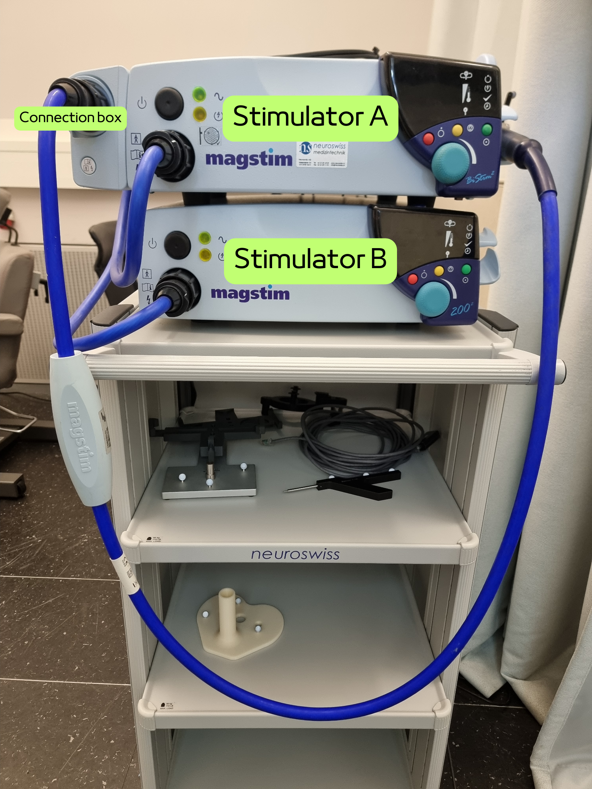
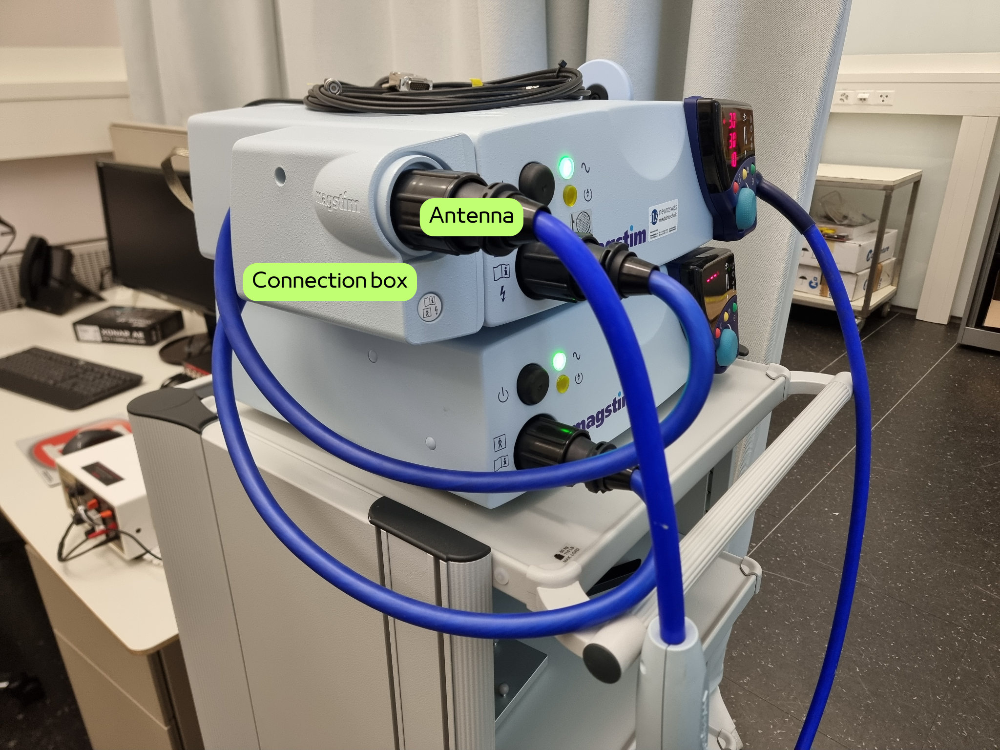

.. include:: ../links.inc

Magstim BiStim²
===============

The `BiStim²`_ is a paired-pulse stimulator combining 2 monophasic stimulators to
deliver paired pulses through 2 separate or through a single coil. The paired pulses can
be delivered with independent stimulation intensities and variable inter-pulse intervals.

Magstim devices share common features that are detailed in the
:ref:`common features section of the guidelines <guidelines_tms:Magstim devices>`.

.. note::

    Contrary to the `Super Rapid² Plus¹`_, the `BiStim²`_ power consumption is handled
    through a single power outlet.

Start-up
--------

The `BiStim²`_ can be started by (1) setting the power switch to ``ON`` behind both
units, and (2) pressing the power button on the front panel of both units.

Coil connections
----------------

To use the `BiStim²`_ as a paired-pulse stimulation with a single antenna, the 2
stimulators must be connected to the appendix on the left side of the stimulator ``A``,
and the antenna must be connected to the same appendix.

.. important::

    If the antenna(s) are coonected to a stimulator directly, the stimulators work
    independently one from another.

Settings
--------

When both stimulators are connected to the same coil, the stimulator A controls the
intensity of both pulses (and stimulators) and the inter-pulse interval. The pulses
can be set to different intensities.

Press on the nob to circle between the 3 settings and turn the nob to set the desired
value.

.. image:: ../_static/magstim/bistim-settings.png
    :align: center
    :class: img-with-border
    :width: 100%

.. tab-set::

    .. tab-item:: Intensity

        Intensity is set as a percentage of the maximum stimulator output. The intensity
        should be defined based on
        :ref:`the individual motor threshold <guidelines_tms:Motor threshold>`.

    .. tab-item:: Inter-pulse interval

        The inter-pulse interval is set in milliseconds and defines the delay between the pulse
        delivered by both stimulators.

        .. attention::

            Using both `BiStim²`_ stimulators connected to the same coil with an inter-pulse
            interval set to ``0`` is not equivalent to using a single `BiStim²`_ stimulator.
            This mode of operation is **not recommended**.

    .. tab-item:: Mode ε (``E``)

        When setting the inter-pulse interval to ``0``, then pressing the red button and turning
        the nob counter-clockwise, the `BiStim²`_ will enter mode ε, displaying an ``E`` in the
        inter-pulse interval display. In this mode, the pulse delivery is controlled by the
        triggers only. The first trigger will deliver a pulse on stimulator A, the second
        trigger will deliver a pulse on stimulator B.

        .. image:: ../_static/magstim/bistim-settings-epsilon.png
            :align: center
            :class: img-with-border
            :width: 100%

        .. tip::

            To exit the mode ε, press the red button and turn the nob clockwise.

        .. important::

            The `BiStim²`_ stimulators need time to recharge between pulses. Thus, after a pulse
            has been delivered on a stimulator, it is up to the user to ensure no new trigger
            attempts to deliver a pulse on the same stimulator before it is ready. Usually, the
            stimulator requires around 1 second to recharge (depends on the pulse intensity).

            If a trigger is sent to a stimulator that is not ready, the `BiStim²`_ will wait
            until it is recharged before delivering the pulse. Thus, the inter-pulse interval
            will **not** be respected.

Datasheet
---------

TODO
