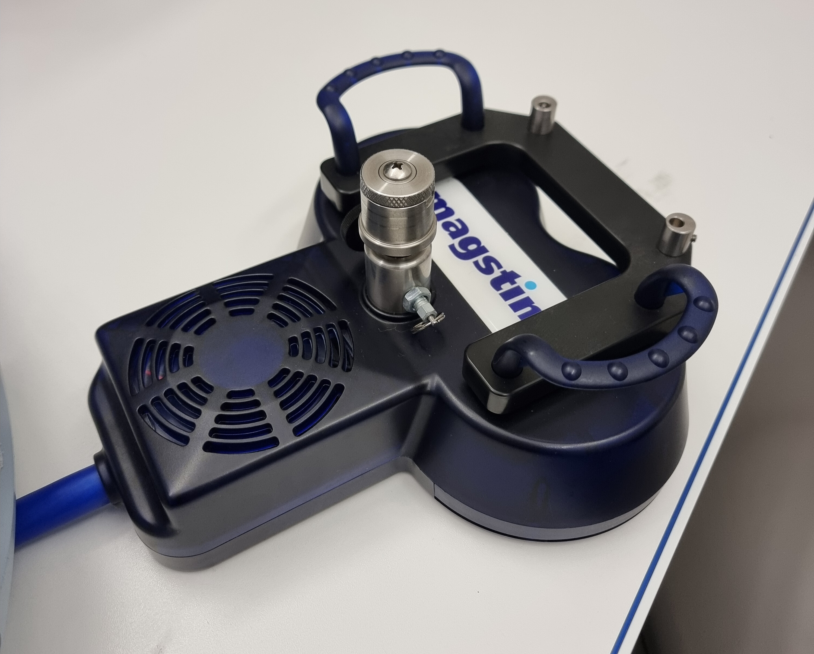

.. include:: ../links.inc

Magstim Super Rapid² Plus¹
==========================

The `Super Rapid² Plus¹`_ is a repetitive stimulator delivering biphasic pulses with
single pulse, repetitive pulse and theta burst stimulation capabilities.

Magstim devices share common features that are detailed in the
:ref:`common features section of the guidelines <guidelines_tms:Magstim devices>`.

.. image:: ../_static/magstim/super-rapid-plus-system.png
    :align: center
    :class: img-with-border
    :width: 400

.. important::

    The `Super Rapid² Plus¹`_ power consumption is important. The system has 3 separate
    alimentation that should be plugged on 3 separate power circuits (**not** only 3
    separate power outlets, but 3 distinct circuits).

Start-up
--------

The `Super Rapid² Plus¹`_ can be started by (1) setting the power switch to ``ON``
behind the top and middle unit, and (2) pressing the power button on the front panel of
the top unit.

Coils
-----

The `Super Rapid² Plus¹`_ **must be used with an actively cooled coil**. Those Coils
include an heatsink and a fan to cool the coil during the stimulation, it is thus
heavier than single-pulse TMS coils.

.. tip::

    A sham coil is available for the `Super Rapid² Plus¹`_. The sham coil feels exactly
    the same as the active coil, but does not deliver any stimulation. It vibrates and
    emits the same noise as the active coil. A tag on the coil cable indicates whether
    the coil is active or sham.

Settings
--------

The tactile screen and the nob are used to configure the stimulation parameters.
The `Super Rapid² Plus¹`_ can deliver single pulse, repetitive pulse and theta burst
stimulation.

.. tab-set::

    .. tab-item:: Single pulse

        In single pulse mode, the only setting available is the intensity. The intensity
        is set as a percentage of the maximum stimulator output and should be defined
        based on the
        :ref:`the individual motor threshold <guidelines_tms:Motor threshold>`.

        .. image:: ../_static/magstim/super-rapid-plus-settings-single-pulse.png
            :align: center
            :class: img-with-border
            :width: 500

    .. tab-item:: Repetitive pulse

        In repetitive pulse mode, burst of 3 pulses are delivered at a fix frequency.
        The settings available are:

        * The intensity (labelled ``power``), defined as a percentage of the maximum
          stimulator output. It should be defined based on the
          :ref:`the individual motor threshold <guidelines_tms:Motor threshold>`.
        * The intra-burst frequency (labelled ``frequency``), defined as the frequency
          of the pulses within the burst.
        * The inter-burst frequency (labelled ``burst frequency``), defined as the
          frequency of the bursts.
        * The number of pulses within a burst (labelled ``number of pulses``).
        * The duration of the stimulation (labelled ``cycle time``).
        * The number of cycles (labelled ``number of cycles``).

        .. image:: ../_static/magstim/super-rapid-plus-settings-repetitive-pulse.png
            :align: center
            :class: img-with-border
            :width: 500

        The pulse train schematics updates based on the settings set, except the number
        of pulses within a burst.

        .. important::

            Each cycle ends with a wait period during which the coil will cool down. The
            wait time is automatically calculated based on the settings set.

        .. tip::

            Instead of planning multiple cycles, it is common to set a single cycle with
            a high number of bursts.

    .. tab-item:: Theta burst

        TODO

Datasheet
---------

TODO
