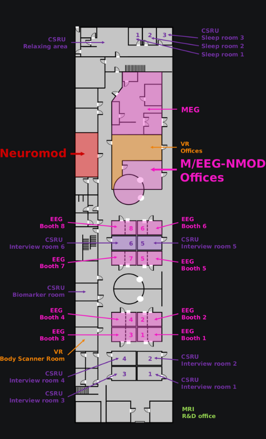
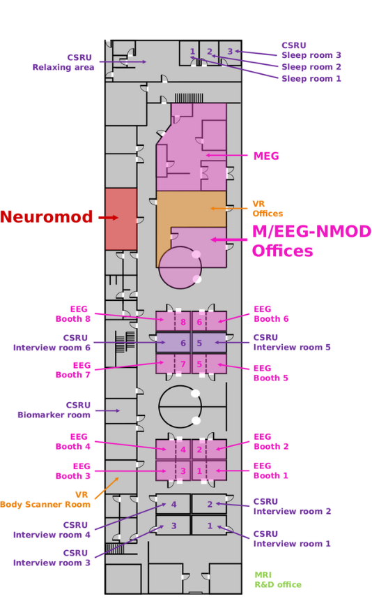

.. include:: ./links.inc

**Neuromod wiki**
=================

.. toctree::
    :hidden:
    :caption: Devices

    devices/magstim-bistim.rst
    devices/magstim-super-rapid-plus.rst

.. toctree::
   :hidden:
   :caption: Code

   api/index.rst
   generated/tutorials/index.rst
   contributing.rst

Wiki for the neuromodulation facility at the Fondation Campus Biotech Geneva.

Where to find us
----------------

The neuromodulation facility is located in ``H4.01``. The main entry is in front of the
Time-out shop. Access to ``H4.01`` is restricted and requires a valid badge.
