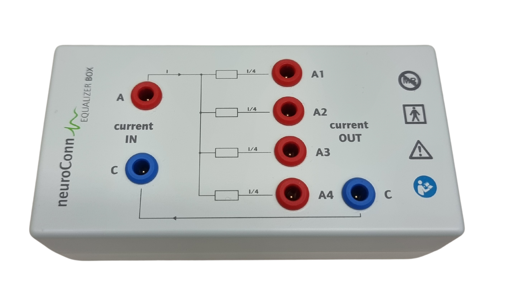

.. include:: ../links.inc

NeuroConn DC-stimulator plus
============================

.. image:: ../_static/neuroconn/interface.png
    :align: right
    :width: 12%

2 `NeuroConn DC-stimulator plus`_ devices are available. The DC-stimulator plus is a
single-channel stimulator for transcranial direct current stimulation (tDCS), with
transcranial random noise stimulation (tRNS) and transcranial alternative current
stimulation (tACS) capabilities. The `NeuroConn DC-stimulator plus`_ is CE marked and
compatible with the 3T MRI scanner.

Start-up
--------

To start the device, switch the power button on the back of the device to the ``1``
position. On the front, the connector panel slides horizontally to reveal either the
DC power connector to charge the device or the stimulation output connector to connect
an electrode.

.. list-table::
   :widths: 300 300
   :header-rows: 1

   * - DC-power connector
     - Electrode connectors
   * - .. image:: ../_static/neuroconn/connectors-dc-power.png
           :align: center
           :alt: DC-power connector
           :class: img-with-border
           :width: 90%

     - .. image:: ../_static/neuroconn/connectors-electrodes.png
           :align: center
           :alt: Electrode connectors
           :class: img-with-border
           :width: 90%

The 4 electrode-side connectors are labeled as follows:

- ``1``: positive ``+`` side, the anode
- ``2``: negative ``-`` side, the cathode
- ``3``: ground ``GND``
- ``4``: trigger input

Connect additional electrodes
-----------------------------

A splitter is available to connect up to 4 anodes. The connector ``1`` on the device is
connected to the anode ``A`` on the splitter. The connector ``2`` on the device is
connected to the cathode ``C`` on the splitter. The splitter divides the current equally
between the connected anodes.

.. note::

    The cathode (blue) can be connected directly to the device without the splitter.

Back panel
----------

The connector ``REMOTE IN`` give precise control over the stimulation. The voltage
applied to the ``REMOTE IN`` connector is transformed linearly into an output current on
the electrodes. Any stimulation waveform is achievable through the ``REMOTE IN``
connector.

The ``SIGNAL OUT`` connector provides a signal proportional to the current flowing
through the electrodes It is useful to monitor the stimulation current.

.. tip::

    Monitoring through ``SIGNAL OUT`` must be enabled in the device settings.

.. image:: ../_static/neuroconn/back-panel.png
    :align: center
    :class: img-with-border
    :width: 60%

Settings
--------

TODO

Study mode
----------

In the settings, the study mode can be enabled. In this mode, the device stimulation
settings are hidden to the experimenter. This is useful for blind studies with sham
protocols.

If the study mode is enabled, the device will request a code during the next boot. This
code will set the stimulation settings for the session.

.. tip::

    If you want to exit the study mode, you can enter the **master code** during boot
    and then disable the study mode in the settings. **The master code is 22671 and
    is written on the front of the device.**
